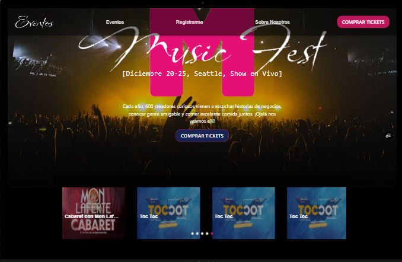
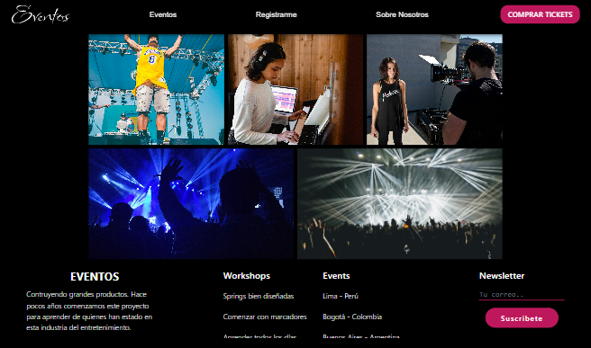
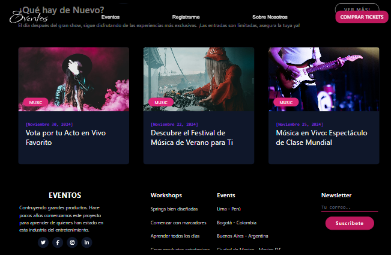

# 🎫 TicketMaster Event Explorer


Aplicación web que permite buscar eventos en tiempo real utilizando la API de TicketMaster. Es ideal para descubrir conciertos, deportes y espectáculos cercanos con solo ingresar una palabra clave.

## 🌐 Demo
🔗 [Ver la aplicación en vivo](https://eventos-ochre.vercel.app/)

## 🖼️ Vista previa






## 🚀 Características

- 🔎 Búsqueda de eventos por nombre
- 📸 Muestra imagen, nombre, fecha y ubicación del evento
- 🌍 Integración con la API de TicketMaster
- 🎨 Diseño responsive y atractivo
- 💡 Feedback visual cuando no hay resultados

## 🛠️ Tecnologías utilizadas

- **React** – Biblioteca principal
- **Material-UI** - Componentes estilizados
- **Tailwind CSS** – Estilos rápidos y responsivos
- **JavaScript (ES6+)**
- **API de TicketMaster**
- **Vite** – Empaquetador rápido
- **Vercel** – Para el deploy

## 🧠 Lo que aprendí

- Cómo consumir APIs externas y manejar sus respuestas
- Cómo manejar el estado de búsqueda en React
- Buenas prácticas de UI/UX para mostrar resultados dinámicos
- Validación de datos y manejo de errores

```bash
git clone https://github.com/EstefaniaDelgado/Eventos.git
cd flashcards-memory-app
npm install
npm run dev


